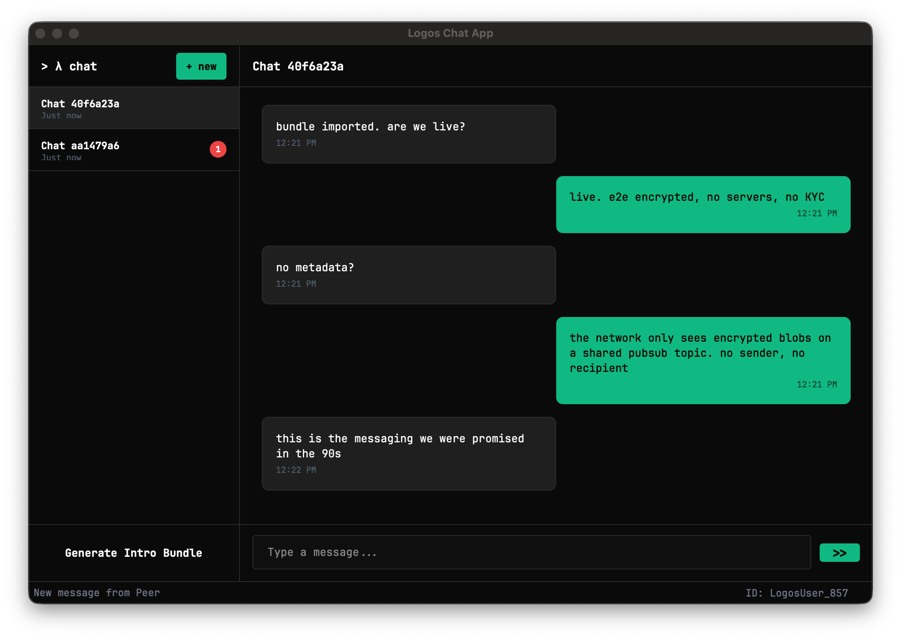

# logos-chat-ui

A Qt-based UI module for the [Logos](https://logos.co) platform that provides a private messaging interface built on top of [Logos Chat](https://github.com/logos-messaging/logos-chat).

The UI connects to [`logos-chat-module`](https://github.com/logos-co/logos-chat-module) via the Logos Core module system for all chat operations — identity, conversations, and message exchange happen over the Logos network.

> **Not to be confused with** [`logos-chat-legacy-ui`](https://github.com/logos-co/logos-chat-legacy-ui), which is a legacy PoC using different backend modules. 
> This repo is the **active** Logos Chat UI.

## What It Does

The application provides a two-panel chat interface with a dark, terminal-inspired theme:

- **Conversation list** (left panel) — shows active conversations with timestamps and unread indicators
- **Chat panel** (right panel) — displays messages and a text input for the selected conversation



Core functionality:

- **Identity** — on startup, initializes a chat identity and displays the user's ID in the status bar
- **Intro bundles** — generate your intro bundle ("My Bundle" button) and share it with others to let them start a conversation with you. A new bundle is needed for each new conversation.
- **New conversations** — paste another user's intro bundle and an initial message to open a private conversation
- **Messaging** — send and receive messages in real-time over the Logos network
- **Chat lifecycle** — initialize, start, and stop the chat engine via the Chat menu (auto-starts on launch by default)

Conversations are **ephemeral** — messages and identity exist only while the app is running and are not persisted across restarts. Message storage (via the store protocol) is planned for a future release.

The UI communicates with the chat backend entirely through [`logos-chat-module`](https://github.com/logos-co/logos-chat-module) events — it does not access the network directly.

## How to Run

### Using Nix (Recommended)

```bash
# Build and run the standalone app
nix run '.#app'

# Or build first, then run
nix build '.#app'
./result/bin/logos-chat-ui-app
```

The standalone app starts Logos Core, loads the required backend modules (`capability_module`, `chat_module`), then loads the `chat_ui` Qt plugin to display the UI.

### Build Targets

```bash
nix build            # default — plugin library only
nix build '.#lib'    # plugin library only
nix build '.#app'    # standalone app with all runtime dependencies
nix develop          # enter development shell
```

> [!NOTE]
> If flakes aren't enabled globally, add `--extra-experimental-features 'nix-command flakes'`. \
> In zsh, quote the target to prevent glob expansion (e.g., `'.#app'`). 

### Using CMake

```bash
mkdir build && cd build
cmake .. -GNinja \
  -DLOGOS_CPP_SDK_ROOT=/path/to/logos-cpp-sdk \
  -DLOGOS_LIBLOGOS_ROOT=/path/to/logos-liblogos
ninja
```

## Output Structure

**Library build** (`nix build`):

```
result/
└── lib/
  └── chat_ui.dylib (.so on Linux)
```

**App build** (`nix build '.#app'`):

```
result/
├── bin/
│   ├── logos-chat-ui-app             # Standalone executable
│   ├── logoscore                     # Logos Core
│   └── logos_host                    # Logos module host
├── lib/
│   ├── liblogos_core.dylib
│   ├── liblogos_sdk.dylib
│   └── liblogoschat.dylib
├── modules/
│   ├── capability_module.dylib       # Auth/capability module
│   ├── chat_module.dylib             # Chat backend
│   └── liblogoschat.dylib
└── chat_ui.dylib                     # UI plugin (loaded by app)
```

## Requirements

> [!TIP]
> When using Nix, all requirements will be acquired automatically.

### Build Tools

- CMake (≥3.16)
- Ninja
- pkg-config

### Dependencies

| Dependency | Purpose |
|---|---|
| Qt6 Core, Widgets | UI framework |
| Qt6 RemoteObjects | LogosAPI communication |
| [`logos-cpp-sdk`](https://github.com/logos-co/logos-cpp-sdk) | LogosAPI, module bindings generator |
| [`logos-liblogos`](https://github.com/logos-co/logos-liblogos) | Logos Core runtime |
| [`logos-chat-module`](https://github.com/logos-co/logos-chat-module) | Chat backend module |
| [`logos-capability-module`](https://github.com/logos-co/logos-capability-module) | Auth/capability module (app only) |

## Architecture

The module runs as a Qt plugin inside Logos Core. The standalone app (`app/`) is a thin shell that bootstraps Logos Core, loads backend modules, and hosts the UI plugin via `QPluginLoader`.

See [`spec.md`](docs/spec.md) for detailed component specifications, widget hierarchy, and signal/slot interfaces.

## Related Repositories

| Repository | Role |
|---|---|
| [`logos-chat-module`](https://github.com/logos-co/logos-chat-module) | Chat backend — this UI's required dependency |
| [`logos-chat`](https://github.com/logos-messaging/logos-chat) | Logos Chat application (provides `liblogoschat`) |
| [`logos-liblogos`](https://github.com/logos-co/logos-liblogos) | Logos Core platform |
| [`logos-chat-legacy-ui`](https://github.com/logos-co/logos-chat-legacy-ui) | Legacy PoC — unrelated to this implementation |