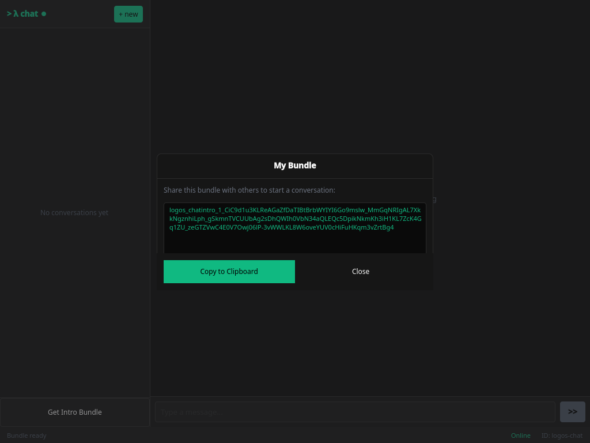

# Two-instance message exchange

The [chat UI tutorial](../doctests/chat-ui.test.yaml) drives a single chat UI
window: it connects to the network and shares an intro bundle. A message
exchange, though, is inherently two-party, and the doc-test `ui_test` harness
cannot express it on its own: it drives one app instance and can only *set
literal values* on fields, so it can never read a freshly generated intro bundle
out of one window and paste it into another. The
[automated exchange tutorial](../doctests/chat-ui-exchange.test.yaml) runs that
round-trip headless via the `exchange` app and captures the result in one
screenshot.

This page covers the other half end-to-end: two real chat UI windows exchanging
encrypted messages over the live network. It is driven by
[`doctests/exchange/run-exchange.mjs`](../doctests/exchange/run-exchange.mjs),
which speaks the [logos-qt-mcp](https://github.com/logos-co/logos-qt-mcp)
inspector protocol to **both** instances at once, so it can read Alice's bundle
out of her window and hand it to Bob, then capture each side of the
conversation. The screenshots below are produced by that script.

Two instances coexist on one host because each picks a random QtRO socket name;
the script gives each its own data dir (`CHAT_MODULE_INSTANCE_PATH`), delivery
node port (`CHAT_MODULE_DELIVERY_PORT`), and QML inspector port
(`QML_INSPECTOR_PORT`).

## Run two instances interactively

To exchange a message by hand, launch two standalone apps, each with its own
data dir and delivery port so they don't collide:

```bash
# window A
CHAT_MODULE_INSTANCE_PATH=~/.local/share/chat_a CHAT_MODULE_DELIVERY_PORT=60000 nix run
# window B
CHAT_MODULE_INSTANCE_PATH=~/.local/share/chat_b CHAT_MODULE_DELIVERY_PORT=60001 nix run
```

Both nodes join the `logos.test` Waku fleet, so this needs internet and ~5-20s to
reach **Online**. Then, in window A tap **Get Intro Bundle** and copy it; in
window B tap **+ new**, paste A's bundle plus a first message, and send. The
conversation appears in A; reply from either side.

## Regenerating the screenshots

```bash
doctests/exchange/run-exchange.sh docs/images/exchange
```

The wrapper builds the standalone app from the flake, launches Alice and Bob
offscreen, runs the exchange, writes the PNGs below, and tears both instances
down. It exits non-zero if the round-trip does not complete, so it doubles as an
end-to-end integration check.

## The exchange

### 1. Alice shares her intro bundle

Alice waits for the network to come up (**Online**), then taps **Get Intro
Bundle**. The backend calls `create_intro_bundle()`, the X3DH prekey bundle a
peer needs to start a conversation with her, and shows it ready to share.



### 2. Bob starts a conversation from it

Bob pastes Alice's bundle into **+ new** and sends a first message. The backend
calls `create_conversation(bundle, message)`, which runs the X3DH initiator side
and sends the first encrypted message to Alice's delivery address. Bob's window
shows the message sent.


### 3. Alice receives it

Alice's inbound worker decrypts the envelope, the `message_received` event lands,
and the conversation appears in her list with Bob's message in the thread.


### 4. Alice replies

Alice replies with `send_message(convo_id, content)`; the reply travels back to
Bob's delivery address.


### 5. Bob receives the reply

The same path in reverse: Bob's thread now shows both messages. A real
bidirectional, end-to-end-encrypted round-trip between two independent UI
instances.


