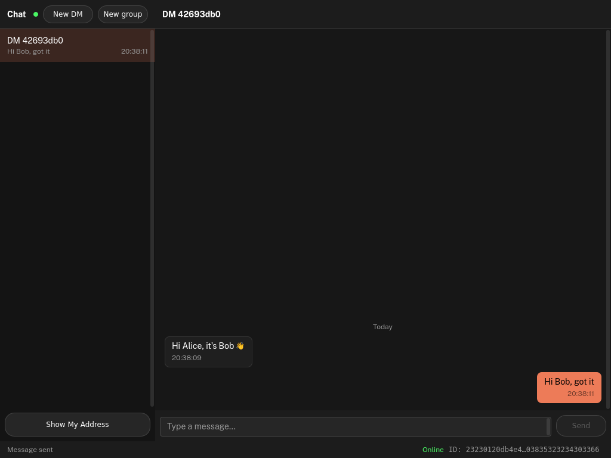
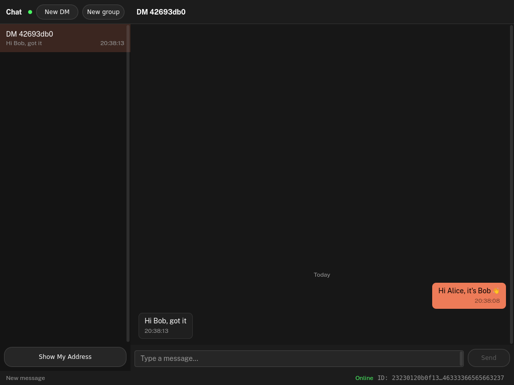

# Two-instance message exchange

The [chat UI tutorial](../doctests/chat-ui.test.yaml) drives a single chat UI
window: it connects to the network and shares its address. A message
exchange, though, is inherently two-party, and the doc-test `ui_test` harness
cannot express it on its own: it drives one app instance and can only *set
literal values* on fields, so it can never read one window's address out and
paste it into another. The
[automated exchange tutorial](../doctests/chat-ui-exchange.test.yaml) runs that
round-trip headless via the `exchange` app and captures the result in one
screenshot.

This page covers the other half end-to-end: two real chat UI windows exchanging
encrypted messages over the live network. It is driven by
[`doctests/exchange/run-exchange.mjs`](../doctests/exchange/run-exchange.mjs),
which speaks the [logos-qt-mcp](https://github.com/logos-co/logos-qt-mcp)
inspector protocol to **both** instances at once, so it can read Alice's address
out of her window and hand it to Bob, then capture each side of the
conversation. The screenshots below are produced by that script.

Two instances coexist on one host because each picks a random QtRO socket name;
the script gives each its own data dir (`CHAT_MODULE_INSTANCE_PATH`), delivery
node port (`CHAT_MODULE_DELIVERY_PORT`), and QML inspector port
(`QML_INSPECTOR_PORT`).

## Run two instances interactively

To exchange a message by hand, launch two standalone apps; the delivery ports
must differ (each is bound by its node), and a distinct instance dir keeps the
two module instances cleanly apart:

```bash
# window A
CHAT_MODULE_INSTANCE_PATH=~/.local/share/chat_a CHAT_MODULE_DELIVERY_PORT=60000 nix run
# window B
CHAT_MODULE_INSTANCE_PATH=~/.local/share/chat_b CHAT_MODULE_DELIVERY_PORT=60001 nix run
```

Both nodes join the `logos.test` Waku fleet (and publish their key packages to
the key-package registry during `init`), so this needs internet and ~5-20s to
reach **Online**. Then, in window A tap **Show My Address** and copy it; in
window B tap **New DM** and paste A's address — the conversation opens on B's
side and the invite goes out. Once it appears in A's list (she has joined),
send the first message from B; reply from either side.

## Regenerating the screenshots

```bash
doctests/exchange/run-exchange.sh docs/images/exchange
```

The wrapper builds the standalone app from the flake, launches Alice and Bob
offscreen, runs the exchange, writes the PNGs below, and tears both instances
down. It exits non-zero if the round-trip does not complete, so it doubles as an
end-to-end integration check.

## The exchange

### 1. Alice shares her address

Alice waits for the network to come up (**Online**), then taps **Show My
Address**. The backend calls `get_address()` — her installation's address; her
key package was published to the registry during `init`, so the address alone
lets a peer open a conversation with her.


### 2. Bob opens a conversation and sends the first message

Bob pastes Alice's address into **New DM**. The backend calls
`create_conversation(address)`, which fetches her key package from the registry
and sends her the cryptographic invite; the new thread opens empty. Once Alice
has joined (the conversation shows up in her list), Bob sends the first
message. Bob's window shows the message sent.


### 3. Alice receives it

Bob's message lands, the `message_received` event fires, and the thread of the
conversation she joined shows it.


### 4. Alice replies

Alice replies with `send_message(convo_id, content)`; the reply travels back
over the same conversation.



### 5. Bob receives the reply

The same path in reverse: Bob's thread now shows both messages. A real
bidirectional, end-to-end-encrypted round-trip between two independent UI
instances.


